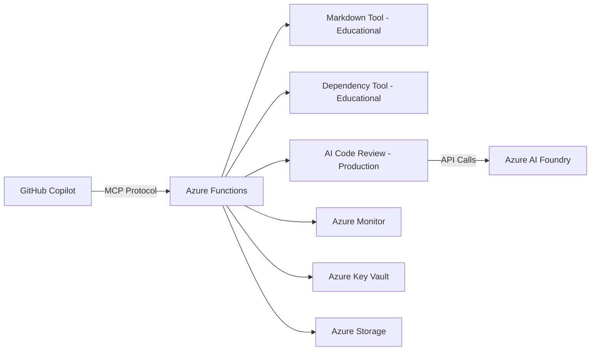

# GitHub Copilot Custom MCP Server with Azure Functions Workshop

## 🚀 Overview

Welcome to this comprehensive workshop where you'll learn to extend GitHub Copilot's capabilities by building and deploying a custom Model Context Protocol (MCP) server on Azure Functions. This workshop demonstrates the complete journey from local development to production AI integration.

### What You'll Build

- **Custom MCP Server**: A serverless MCP server with three types of tools
- **Educational Tools**: Markdown review and dependency checking with local algorithms
- **Production AI Tool**: Azure AI-powered code review demonstrating true MCP architecture
- **Azure Functions Deployment**: Scalable, serverless hosting for your MCP server
- **GitHub Copilot Integration**: Seamless connection between Copilot and your custom tools

### Learning Outcomes

By the end of this workshop, you'll understand:
- ✅ The difference between educational and production MCP tools
- ✅ How to build and deploy serverless MCP servers on Azure Functions
- ✅ True MCP architecture: tools provide context, AI provides intelligence
- ✅ GitHub Copilot integration patterns and best practices
- ✅ Azure AI Foundry integration with graceful fallback patterns

## ⚡ How to start! Quick Start Options:

### 🌟 **Option 1: GitHub Codespaces (Recommended - Zero Setup)**
Click the **"Open in GitHub Codespaces"** badge above for instant setup!
- ✅ **No local installation required**
- ✅ **Pre-configured Linux environment with all tools**
- ✅ **Works on any device with a browser**
- ✅ **Ready in 2-3 minutes**
- 📖 **Follow the [Linux/Bash Documentation Path](docs/linux/)**

### 💻 **Option 2: Local Development**
Choose your platform for local development:

#### 🐧 **Linux/macOS (Bash)**  
- 📖 **[Linux Workshop Documentation](docs/linux/)** - Complete Linux setup with Bash commands
- 🛠️ **Requirements**: Node.js, Azure CLI, Azure Functions Core Tools, VS Code
- 💡 **Best for**: Linux/macOS developers, Bash users, script automation

---

## 📚 Choose Your Workshop Path

| Platform | Quick Start | Documentation | Best For |
|----------|-------------|---------------|----------|
| **🌟 Codespaces** |  | [📖 Linux/Bash Docs](docs/linux/) | Zero setup, any device |
| **🐧 Linux/macOS** | [Setup Guide](docs/linux/setup.md) | [📖 Linux/Bash Docs](docs/linux/) | Linux/macOS developers |

## 🛠️ Prerequisites

### Required Software
- [Node.js](https://nodejs.org/) (v18 or later)
- [Azure CLI](https://docs.microsoft.com/en-us/cli/azure/install-azure-cli)
- [Azure Functions Core Tools](https://docs.microsoft.com/en-us/azure/azure-functions/functions-run-local)
- [GitHub Copilot](https://github.com/features/copilot) subscription
- [VS Code](https://code.visualstudio.com/) with Copilot extension

### Azure Account
- Azure subscription (free tier works!)
- Contributor access to create resources

### Knowledge Level
- Intermediate JavaScript/TypeScript
- Basic Azure Functions knowledge
- Familiarity with GitHub Copilot

## 📋 Workshop Flow (3 Hours Total)

*Choose your platform path above, then follow these sequential steps:*

### [Part 1: Setup and Understanding](docs/{platform}/part-1-setup-and-understanding.md) (30 minutes)
1. Understanding MCP and Architecture Patterns
2. Environment Setup and Prerequisites  
3. Project Structure and Dependencies

### [Part 2: Local Development](docs/{platform}/part-2-local-development.md) (45 minutes)
1. Building the MCP Server Core
2. Creating Educational Tools (markdown review, dependency check)
3. Implementing Production AI Tool Architecture
4. Testing Locally with Azure Functions

### [Part 3: Azure Deployment](docs/{platform}/part-3-azure-deployment.md) (30 minutes)
1. Infrastructure as Code with Bicep
2. Deploying to Azure Functions
3. Monitoring and Troubleshooting

### [Part 4: GitHub Copilot Integration](docs/{platform}/part-4-copilot-integration.md) (30 minutes)
1. Configuring MCP in VS Code
2. Testing Tool Discovery and Usage
3. Advanced Integration Patterns

### [Part 5: AI Integration](docs/{platform}/part-5-ai-integration.md) (45 minutes) 🤖
1. Setting Up Azure AI Foundry
2. Implementing Real AI Analysis
3. Comparing Educational vs Production Tools
4. Understanding True MCP Architecture

## 🏗️ Architecture Overview

### Tool Categories

This workshop demonstrates **three distinct tool patterns**:

#### 🎓 Educational Tools
- **`markdown_review`**: Local analysis algorithms, quality scoring
- **`dependency_check`**: Static package analysis, security checks
- **Purpose**: Learn MCP concepts, no external dependencies

#### 🚀 Production Tools  
- **`ai_code_review`**: Azure AI integration with intelligent analysis
- **Purpose**: Demonstrate true MCP architecture (tools provide context, AI provides intelligence)
- **Features**: Real LLM analysis, graceful fallback to mock analysis

#### 🔄 Hybrid Approach
All tools work **without Azure costs (minor GPT3.5 cost($.10) if desired)** through intelligent fallback patterns, making the workshop accessible to everyone while demonstrating production capabilities.

## 🎯 Key Learning Outcomes

### Technical Skills
- ✅ MCP protocol implementation with JSON-RPC 2.0
- ✅ Azure Functions serverless development
- ✅ TypeScript development with Azure tooling
- ✅ Infrastructure as Code with Bicep
- ✅ Azure AI service integration

### Architectural Understanding  
- ✅ Educational vs Production MCP tool patterns
- ✅ Graceful degradation and fallback strategies
- ✅ True MCP architecture: tools provide context, AI provides intelligence
- ✅ Serverless cost optimization strategies
- ✅ Security considerations for production MCP servers

### GitHub Copilot Integration
- ✅ MCP server configuration in VS Code
- ✅ Tool discovery and usage patterns
- ✅ Advanced integration scenarios
- ✅ Troubleshooting and monitoring

## 🏁 Workshop Navigation

### 🌟 **Codespaces Users (Recommended)**
**Start Here**: [Part 1: Setup and Understanding](docs/linux/part-1-setup-and-understanding.md)

### 🐧 **Linux/macOS Users**
**Start Here**: [Part 1: Setup and Understanding](docs/linux/part-1-setup-and-understanding.md)

---

## 🌟 What Makes This Workshop Special

1. **Progressive Complexity**: From simple local tools to production AI integration
2. **Cost Conscious**: Carefully curated services for lowest possible cost.
3. **Real-World Ready**: Production patterns with security considerations  
4. **Complete Coverage**: Local development → Azure deployment → Copilot integration → AI enhancement
5. **Hands-On Testing**: Comprehensive test scripts for every stage

## 🤝 Support and Contributing

- **Issues**: Found a bug? [Open an issue](https://github.com/your-repo/issues)
- **Discussions**: Questions? [Start a discussion](https://github.com/your-repo/discussions) 
- **Contributing**: See [CONTRIBUTING.md](CONTRIBUTING.md) for guidelines

## 📄 License

MIT License - see [LICENSE](LICENSE) file for details.

---