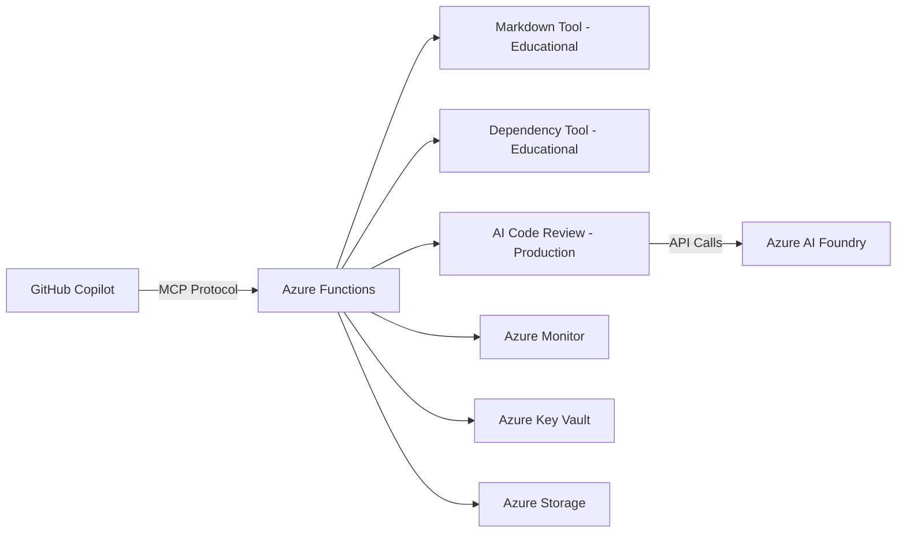

# GitHub Copilot Custom MCP Server with Azure Functions Workshop

[](https://portal.azure.com/#create/Microsoft.Template/uri/https%3A%2F%2Fraw.githubusercontent.com%2Fyour-repo%2Fserverless-mcp-on-functions%2Fmain%2Finfra%2Fmain.json)

## 🚀 Overview

Welcome to this comprehensive workshop where you'll learn to extend GitHub Copilot's capabilities by building and deploying a custom Model Context Protocol (MCP) server on Azure Functions. This workshop demonstrates the complete journey from local development to production AI integration.

### What You'll Build

- **Custom MCP Server**: A serverless MCP server with three types of tools
- **Educational Tools**: Markdown review and dependency checking with local algorithms
- **Production AI Tool**: Azure AI-powered code review demonstrating true MCP architecture
- **Azure Functions Deployment**: Scalable, serverless hosting for your MCP server
- **GitHub Copilot Integration**: Seamless connection between Copilot and your custom tools

### Learning Outcomes

By the end of this workshop, you'll understand:
- ✅ The difference between educational and production MCP tools
- ✅ How to build and deploy serverless MCP servers on Azure Functions
- ✅ True MCP architecture: tools provide context, AI provides intelligence
- ✅ GitHub Copilot integration patterns and best practices
- ✅ Azure AI Foundry integration with graceful fallback patterns

## 🛠️ Prerequisites

### Required Software
- [Node.js](https://nodejs.org/) (v18 or later)
- [Azure CLI](https://docs.microsoft.com/en-us/cli/azure/install-azure-cli)
- [Azure Functions Core Tools](https://docs.microsoft.com/en-us/azure/azure-functions/functions-run-local)
- [GitHub Copilot](https://github.com/features/copilot) subscription
- [VS Code](https://code.visualstudio.com/) with Copilot extension

### Azure Account
- Azure subscription (free tier works!)
- Contributor access to create resources

### Knowledge Level
- Intermediate JavaScript/TypeScript
- Basic Azure Functions knowledge
- Familiarity with GitHub Copilot

## 📋 Workshop Flow (3 Hours Total)

### [Part 1: Setup and Understanding](docs/part-1-setup-and-understanding.md) (30 minutes)
1. Understanding MCP and Architecture Patterns
2. Environment Setup and Prerequisites  
3. Project Structure and Dependencies

### [Part 2: Local Development](docs/part-2-local-development.md) (45 minutes)
1. Building the MCP Server Core
2. Creating Educational Tools (markdown review, dependency check)
3. Implementing Production AI Tool Architecture
4. Testing Locally with Azure Functions

### [Part 3: Azure Deployment](docs/part-3-azure-deployment.md) (30 minutes)
1. Infrastructure as Code with Bicep
2. Deploying to Azure Functions
3. Monitoring and Troubleshooting

### [Part 4: GitHub Copilot Integration](docs/part-4-copilot-integration.md) (30 minutes)
1. Configuring MCP in VS Code
2. Testing Tool Discovery and Usage
3. Advanced Integration Patterns

### [Part 5: AI Integration](docs/part-5-ai-integration.md) (45 minutes) 🤖
1. Setting Up Azure AI Foundry Free Tier
2. Implementing Real AI Analysis
3. Comparing Educational vs Production Tools
4. Understanding True MCP Architecture

## 🚀 Quick Start

### 1. Clone and Setup
```bash
git clone <your-repo-url>
cd serverless_mcp_on_functions_for_github_copilot
npm install && npm run build
```

### 2. Test Locally
```bash
func start --port 7071
.\test-workshop.ps1 -TestLevel local
```

### 3. Deploy to Azure
```bash
az login
az group create --name mcp-workshop-rg --location eastus
az deployment group create --resource-group mcp-workshop-rg --template-file infra/main.bicep
func azure functionapp publish mcp-workshop-func --typescript
```

### 4. Add AI Integration (Optional)
```bash
.\setup-azure-ai.ps1
.\test-ai-integration.ps1
```

### 5. Connect to GitHub Copilot
Add to VS Code settings.json:
```json
{
  "github.copilot.chat.mcp.servers": {
    "mcp-workshop": {
      "endpoint": "https://your-function-app.azurewebsites.net/api/mcp-server"
    }
  }
}
```

## 🏗️ Architecture Overview



### Tool Categories

This workshop demonstrates **three distinct tool patterns**:

#### 🎓 Educational Tools
- **`markdown_review`**: Local analysis algorithms, quality scoring
- **`dependency_check`**: Static package analysis, security checks
- **Purpose**: Learn MCP concepts, no external dependencies

#### 🚀 Production Tools  
- **`ai_code_review`**: Azure AI integration with intelligent analysis
- **Purpose**: Demonstrate true MCP architecture (tools provide context, AI provides intelligence)
- **Features**: Real LLM analysis, graceful fallback to mock analysis

#### 🔄 Hybrid Approach
All tools work **without Azure costs** through intelligent fallback patterns, making the workshop accessible to everyone while demonstrating production capabilities.

# Set your subscription (if you have multiple)
az account set --subscription "your-subscription-id"
```

## 📁 Project Structure

```
├── docs/                           # Workshop documentation  
│   ├── part-1-setup-and-understanding.md
│   ├── part-2-local-development.md
│   ├── part-3-azure-deployment.md
│   ├── part-4-copilot-integration.md
│   └── part-5-ai-integration.md
├── src/                            # MCP server source code
│   ├── functions/mcp-server.ts     # Azure Functions HTTP trigger
│   ├── mcp/server.ts              # MCP protocol implementation
│   ├── tools/                     # Custom MCP tools
│   │   ├── markdown-review.ts     # Educational: Local analysis
│   │   ├── dependency-check.ts    # Educational: Package analysis  
│   │   └── ai-code-review.ts      # Production: Azure AI integration
│   └── utils/                     # Shared utilities
├── infra/                         # Azure infrastructure (Bicep)
├── tests/                         # Test suites
├── test-workshop.ps1              # Comprehensive test script
├── test-ai-integration.ps1        # AI integration tests
└── setup-azure-ai.ps1             # Azure AI setup automation
```

## 🧪 Testing Your Setup

### Complete Workshop Test
```bash
# Test local development
.\test-workshop.ps1 -TestLevel local

# Test Azure deployment  
.\test-workshop.ps1 -TestLevel azure -FunctionUrl "https://your-app.azurewebsites.net/api/mcp-server"

# Test AI integration
.\test-ai-integration.ps1
```

## 🎯 Key Learning Outcomes

### Technical Skills
- ✅ MCP protocol implementation with JSON-RPC 2.0
- ✅ Azure Functions serverless development
- ✅ TypeScript development with Azure tooling
- ✅ Infrastructure as Code with Bicep
- ✅ Azure AI service integration

### Architectural Understanding  
- ✅ Educational vs Production MCP tool patterns
- ✅ Graceful degradation and fallback strategies
- ✅ True MCP architecture: tools provide context, AI provides intelligence
- ✅ Serverless cost optimization strategies
- ✅ Security considerations for production MCP servers

### GitHub Copilot Integration
- ✅ MCP server configuration in VS Code
- ✅ Tool discovery and usage patterns
- ✅ Advanced integration scenarios
- ✅ Troubleshooting and monitoring

## � Workshop Navigation

**Start Here**: [Part 1: Setup and Understanding](docs/part-1-setup-and-understanding.md)

**Quick AI Setup**: [QUICKSTART-AI.md](QUICKSTART-AI.md) for fast Azure AI integration

## 🌟 What Makes This Workshop Special

1. **Progressive Complexity**: From simple local tools to production AI integration
2. **Cost Conscious**: Free tier options with graceful fallbacks
3. **Real-World Ready**: Production patterns with security considerations  
4. **Complete Coverage**: Local development → Azure deployment → Copilot integration → AI enhancement
5. **Hands-On Testing**: Comprehensive test scripts for every stage

## 🤝 Support and Contributing

- **Issues**: Found a bug? [Open an issue](https://github.com/your-repo/issues)
- **Discussions**: Questions? [Start a discussion](https://github.com/your-repo/discussions) 
- **Contributing**: See [CONTRIBUTING.md](CONTRIBUTING.md) for guidelines

## 📄 License

MIT License - see [LICENSE](LICENSE) file for details.

---

🚀 **Ready to extend GitHub Copilot with custom tools?** Start with [Part 1: Setup and Understanding](docs/part-1-setup-and-understanding.md)!
