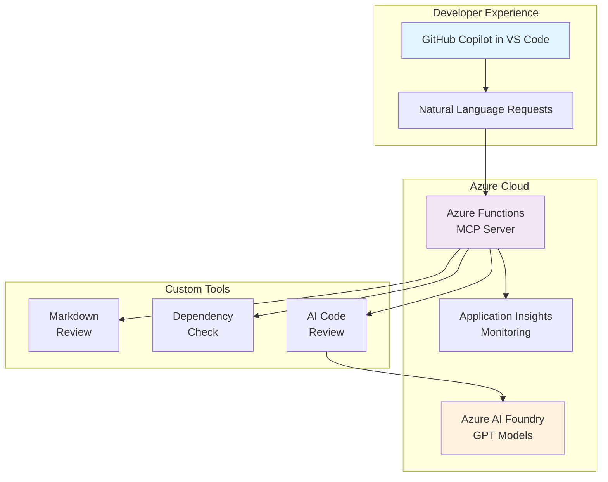

# GitHub Copilot MCP Server Workshop

## 🎯 Complete Workshop: Building a Custom MCP Server for GitHub Copilot

This comprehensive workshop teaches you to build, deploy, and integrate a custom Model Context Protocol (MCP) server with GitHub Copilot using Azure Functions and Azure AI.

---

## � Quick Start: Deploy Your Codespace

**Haven't set up your workshop environment yet?** 

## 📚 Workshop Structure

### **Part 1: [Understanding MCP & Workshop Setup]**
- **Objective**: Learn MCP concepts and prepare your development environment
- **Topics**: MCP protocol basics, Azure Functions overview, prerequisites setup
- **Outcome**: Ready development environment with project structure

### **Part 2: [Local Development & Building MCP Server]**
- **Objective**: Build and test the MCP server locally with three custom tools
- **Topics**: Tool implementation patterns, local testing, MCP protocol implementation
- **Outcome**: Working MCP server with educational and production tool patterns

### **Part 3: [Azure Deployment & Architecture Deep Dive]**
- **Objective**: Deploy MCP server to Azure Functions for global serverless hosting
- **Topics**: Infrastructure as code, serverless deployment, monitoring setup
- **Outcome**: Production-deployed MCP server with observability

### **Part 4: [GitHub Copilot Integration]**
- **Objective**: Connect your Azure-hosted MCP server to GitHub Copilot in VS Code
- **Topics**: VS Code configuration, MCP client setup, integration testing
- **Outcome**: GitHub Copilot using your custom tools in real development workflows

### **Part 5: [AI Integration with Azure AI Foundry]**
- **Objective**: Transform mock tools into real AI-powered analysis using Azure AI
- **Topics**: Azure AI Foundry setup, model deployment, production AI integration
- **Outcome**: Production-ready AI-enhanced MCP server with intelligent code analysis

---

## 🛠️ What You'll Build

### **Three Custom MCP Tools**

1. **📝 Markdown Review Tool**
   - Analyzes markdown content structure and quality
   - Validates links and accessibility
   - Provides improvement recommendations
   - *Educational pattern*: Local algorithms

2. **🔒 Dependency Check Tool** 
   - Scans npm packages for security vulnerabilities
   - Identifies outdated dependencies
   - Suggests upgrade paths and alternatives
   - *Educational pattern*: Known vulnerability database

3. **🤖 AI Code Review Tool**
   - AI-powered code analysis and recommendations
   - Security assessment and best practices
   - Performance optimization suggestions
   - *Production pattern*: Azure AI Foundry integration

### **Complete Architecture**

---

## 🎯 Learning Objectives

By completing this workshop, you will:

- ✅ **Understand MCP Protocol**: Learn how AI assistants discover and use external tools
- ✅ **Master Serverless Deployment**: Deploy scalable Azure Functions with monitoring
- ✅ **Integrate AI Services**: Connect Azure AI Foundry for intelligent analysis
- ✅ **Enhance Developer Workflow**: Create custom GitHub Copilot capabilities
- ✅ **Apply Best Practices**: Implement production patterns for reliability and security

---

## ⚡ Quick Start Path

**Estimated Time**: 2-3 hours for complete workshop

### 🚀 Fast Track (Experienced Developers)
1. **Part 1**: 15 minutes - Setup and understanding
2. **Part 2**: 30 minutes - Local development and testing
3. **Part 3**: 30 minutes - Azure deployment
4. **Part 4**: 15 minutes - Copilot integration
5. **Part 5**: 45 minutes - AI integration

### 📖 Learning Path (New to MCP/Azure)
1. **Part 1**: 30 minutes - Thorough concept review
2. **Part 2**: 45 minutes - Detailed implementation study
3. **Part 3**: 45 minutes - Infrastructure deep dive
4. **Part 4**: 30 minutes - Integration troubleshooting
5. **Part 5**: 60 minutes - AI service configuration

---

## 💰 Cost Information

### **Free Tier Components**
- **Azure Functions**: 1 million free requests/month
- **Azure AI Foundry**: Free trial credits + basic GPT quotas
- **Application Insights**: 1GB free data/month
- **Storage Account**: 5GB free storage

**Estimated Workshop Cost**: $0-5 USD (within free tiers)

---

## 📋 Prerequisites

### **Required Software**
- Node.js 18+ 
- Azure CLI
- Azure Functions Core Tools v4
- VS Code with extensions:
  - Azure Functions
  - GitHub Copilot
  - Azure Account

### **Required Accounts**
- Azure account (free tier sufficient)
- GitHub account with Copilot subscription
- Basic familiarity with TypeScript/JavaScript

---

## 🎉 Workshop Outcomes

### **For Individual Developers**
- Custom AI assistant capabilities in VS Code
- Enhanced code review and analysis workflow
- Understanding of modern AI integration patterns

### **For Development Teams** 
- Shared MCP servers for consistent tooling
- Centralized AI-enhanced development assistance
- Scalable architecture for team-wide adoption

### **for Organizations**
- Foundation for enterprise MCP server development
- Secure, compliant AI integration patterns
- Cost-effective serverless architecture

---

## 🚀 Get Started Now!

**Ready to transform your development workflow with AI-enhanced GitHub Copilot?**

👉 **[Begin with Part 1: Understanding MCP & Workshop Setup →](part-1-understanding-mcp-and-setup.md)**

---

## 📚 Additional Resources

### **Reference Documentation**
- **[Architecture Patterns](reference-architecture-patterns.md)**: Deep dive into MCP implementation approaches
- **[MCP Protocol Specification](https://modelcontextprotocol.io/)**: Official MCP documentation
- **[Azure Functions Documentation](https://docs.microsoft.com/azure/azure-functions/)**: Complete Azure Functions guide

### **Community & Support**
- **[GitHub Discussions](https://github.com/your-repo/discussions)**: Workshop questions and community support
- **[Issues](https://github.com/your-repo/issues)**: Bug reports and feature requests
- **[MCP Community](https://modelcontextprotocol.io/community)**: Broader MCP ecosystem

---

**🎯 Start building the future of AI-assisted development today!**