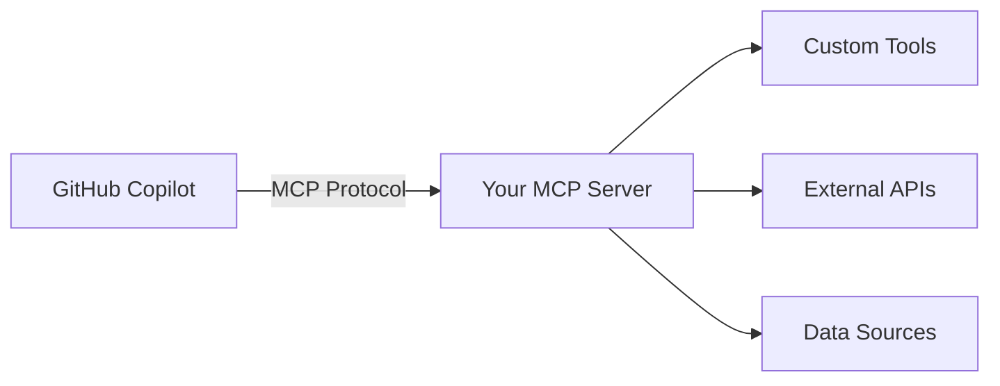
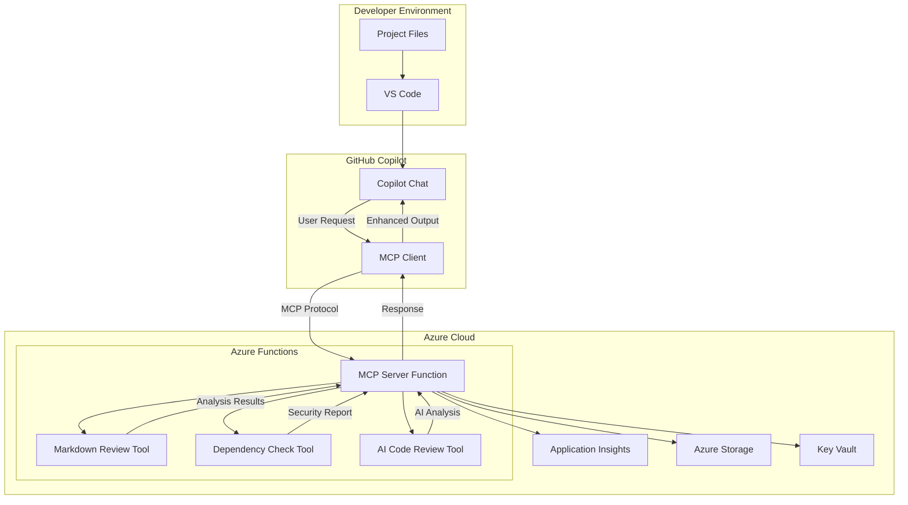

# Part 1: Understanding MCP & Workshop Setup (Linux/Codespaces)

> **Workshop Navigation**: [Part 2: Local Development →](part-2-local-development.md) | **Platform**: 🐧 Linux/Bash & 🌟 Codespaces

## � Quick Start: Deploy Your Codespace

**Haven't set up your workshop environment yet?** 

[](https://codespaces.new/owainow/github-copilot-mcp-server-workshop)


## �🎯 Workshop Overview

This workshop takes you through building a complete **GitHub Copilot Custom MCP Server** using Azure Functions, progressing through five key stages:

1. **Understanding & Setup** *(This part)*: Learn MCP concepts and prepare environment
2. **Local Development**: Build and test MCP server locally with custom tools
3. **Azure Deployment**: Deploy serverless MCP server to Azure Functions
4. **Copilot Integration**: Connect MCP server to GitHub Copilot in VS Code
5. **AI Integration**: Add Azure AI Foundry for intelligent analysis

---

## 🤔 What is the Model Context Protocol (MCP)?

The **Model Context Protocol (MCP)** is a groundbreaking open standard that creates secure, standardized connections between AI applications like GitHub Copilot and external data sources, tools, and services. Think of it as a universal adapter that allows AI assistants to safely access and interact with your development tools, APIs, and data.

### Key MCP Concepts

#### 1. **Secure Connections**
MCP establishes encrypted, authenticated connections between AI applications and external resources, ensuring that sensitive data and operations remain protected.

#### 2. **Standardized Interface**
Instead of each AI application implementing custom integrations, MCP provides a consistent protocol that works across different AI platforms and tools.

#### 3. **Tool Extensibility**
MCP allows you to extend AI capabilities by providing custom tools that the AI can discover and use automatically.

#### 4. **Context Preservation**
The protocol maintains context across interactions, allowing for more sophisticated and stateful operations.

### MCP Architecture



---

## 💡 GitHub Copilot + MCP: A Powerful Combination

GitHub Copilot's integration with MCP transforms it from a code completion tool into a comprehensive development assistant that can:

- **Access External APIs**: Query databases, call REST APIs, and interact with cloud services
- **Execute Development Tools**: Run linters, formatters, security scanners, and custom scripts
- **Analyze Project Data**: Review documentation, check dependencies, and assess code quality
- **Automate Workflows**: Trigger deployments, create issues, and manage project tasks

### Real-World Example

Instead of manually running:
```bash
npm audit
npm outdated
markdownlint README.md
```

You can simply ask Copilot: *"Can you check my project for security issues and review my documentation?"*

Copilot will automatically use your custom MCP tools to:
1. Scan for security vulnerabilities
2. Check for outdated dependencies  
3. Review markdown files for issues
4. Provide actionable recommendations

---

## 🛠️ Workshop Tools Overview

We'll build three different types of tools to demonstrate MCP patterns:

### 🎓 Educational Tools
- **`markdown_review`**: Analyzes markdown content with local algorithms
- **`dependency_check`**: Checks npm packages for security and updates
- **Purpose**: Learn MCP concepts without external dependencies

### 🤖 Production Tools  
- **`ai_code_review`**: Uses Azure AI for intelligent code analysis
- **Purpose**: Demonstrate true MCP architecture (tools provide context, AI provides intelligence)

### 🔄 Hybrid Benefits
- All tools work offline for learning
- AI integration shows production capabilities
- Graceful fallbacks ensure reliability

---

## ☁️ Why Azure Functions for MCP Servers?

Azure Functions provides the ideal hosting platform for MCP servers with several key advantages:

### 1. **Serverless Architecture**
- **Pay-per-use**: Only pay for actual function executions
- **Zero maintenance**: No servers to manage or patch
- **Automatic scaling**: Handles traffic spikes automatically

### 2. **Security and Compliance**
- **Built-in authentication**: Azure AD, OAuth, and API key support
- **Network isolation**: VNet integration and private endpoints
- **Compliance**: SOC, ISO, and other industry certifications

### 3. **Developer Experience**
- **Multiple languages**: Node.js, Python, C#, Java, and more
- **Local development**: Azure Functions Core Tools for local testing
- **CI/CD integration**: GitHub Actions and Azure DevOps support

### 4. **Azure Ecosystem Integration**
- **Monitor**: Application Insights for observability
- **Secure secrets**: Key Vault integration
- **Data access**: Seamless integration with Azure services

---

## 🏗️ Architecture Overview

Our workshop implementation follows this architecture:



---

## ✅ Prerequisites

### Required Software
- **Node.js 18+**: For Azure Functions runtime
- **Azure Functions Core Tools**: For local development
- **Azure CLI**: For deployment
- **Git**: For version control
- **VS Code**: Recommended editor
- **Bash shell**: For running workshop scripts

### Azure Account
- Free Azure account with:
  - Azure Functions (Consumption plan)
  - Azure AI Foundry (F0 free tier)
  - Resource group permissions

### GitHub Account
- GitHub account with Copilot access
- Repository for your MCP server

---

## 🚀 Installation

### 🌟 **If Using Codespaces (Recommended)**

All tools are pre-installed! Just verify they're working:

```bash
# Verify installations (pre-configured in Codespaces)
node --version
func --version
az --version

# You're ready to go - skip to "Project Setup" below!
```

My preference is to open codespaces in VScode on my desktop. You can do that directly from File -> Open in VsCode Desktop.

### 🐧 **If Using Local Linux/macOS**

```bash
# Install Node.js 18+ using your package manager
# Ubuntu/Debian:
curl -fsSL https://deb.nodesource.com/setup_18.x | sudo -E bash -
sudo apt-get install -y nodejs

# macOS with Homebrew:
brew install node@18

# Install Azure Functions Core Tools
npm install -g azure-functions-core-tools@4 --unsafe-perm true

# Install Azure CLI
# Ubuntu/Debian:
curl -sL https://aka.ms/InstallAzureCLIDeb | sudo bash

# macOS with Homebrew:
brew install azure-cli

# Verify installations
node --version
func --version
az --version
```

---

## 🔧 Project Setup

### 1. **Codespaces Users**: You're already in the project!

```bash
# Check you're in the right place
pwd
# Should show: /workspaces/github-copilot-mcp-server-workshop

# Install dependencies and build
npm install && npm run build
```

### 2. **Local Users**: Clone and Setup

```bash
# Clone the workshop repository
git clone <your-repo-url>
cd serverless_mcp_on_functions_for_github_copilot

# Install dependencies
npm install

# Build the project
npm run build
```


---

## 📁 Project Structure

```
├── src/
│   ├── functions/           # Azure Functions
│   │   └── mcp-server.ts   # Main MCP endpoint
│   ├── mcp/                # MCP protocol implementation
│   │   └── server.ts       # MCP server logic
│   ├── tools/              # Custom MCP tools
│   │   ├── markdown-review.ts
│   │   ├── dependency-check.ts
│   │   └── ai-code-review.ts
│   └── utils/              # Shared utilities
├── infra/                  # Azure Bicep templates
├── docs/                   # Workshop documentation
└── tests/                  # Test files
```


---

## 🎉 Benefits of This Approach

### For Developers
- **Enhanced Productivity**: AI assistant with custom capabilities
- **Consistent Experience**: Same tools available across different projects
- **Reduced Context Switching**: Stay in VS Code while accessing powerful tools

### For Teams
- **Standardized Tooling**: Shared MCP servers across team members
- **Centralized Maintenance**: Update tools in one place
- **Audit Trail**: All tool usage is logged and traceable

### For Organizations
- **Scalable Architecture**: Serverless scaling based on usage
- **Cost Effective**: Pay only for what you use
- **Secure by Design**: Enterprise-grade security controls
- **Compliance Ready**: Built on Azure's compliance foundation

---

## ✅ Ready for Part 2!

Your Linux/Codespaces development environment is configured and ready to build the MCP server.

**Key Takeaways:**
- ✅ **MCP enables secure, standardized AI tool integration**
- ✅ **Azure Functions provides the perfect serverless hosting platform**
- ✅ **The combination creates powerful, scalable development assistants**
- ✅ **This approach scales from individual developers to enterprise teams**

---

> **Next Step**: Continue to [Part 2: Local Development →](part-2-local-development.md) where we'll build and test the MCP server locally with all three custom tools using bash commands.

---

## 📚 Additional Resources

- [MCP Official Documentation](https://modelcontextprotocol.io/)
- [Azure Functions Documentation](https://docs.microsoft.com/azure/azure-functions/)
- [GitHub Copilot MCP Integration](https://docs.github.com/copilot/customizing-copilot)
- [Workshop Architecture Reference](../reference-architecture-patterns.md)
- [GitHub Codespaces Documentation](https://docs.github.com/en/codespaces)
- [Azure Functions on Linux](https://docs.microsoft.com/en-us/azure/azure-functions/functions-create-first-azure-function-azure-cli?tabs=bash%2Cbrowser&pivots=programming-language-typescript)