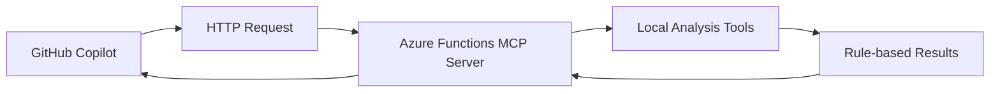
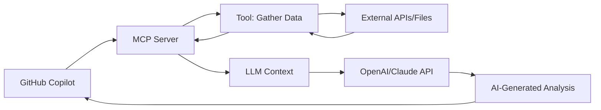

# MCP Architecture: Workshop vs. Production

## Current Workshop Implementation



**What happens:**
1. Copilot calls our MCP server
2. Our tools run local analysis algorithms
3. We return pre-computed results
4. Copilot displays the results

## True MCP Production Architecture



**What should happen:**
1. Copilot calls MCP server for data
2. MCP tools gather raw information
3. Raw data is provided as context to the LLM
4. The LLM analyzes and generates intelligent responses
5. Copilot displays AI-generated insights

## Key Differences

### Workshop Approach (Educational)
- ✅ Easy to understand and test
- ✅ Self-contained and predictable
- ✅ No external API dependencies
- ❌ Not using AI intelligence
- ❌ Limited to pre-programmed responses

### Production MCP Approach
- ✅ Leverages AI for intelligent analysis
- ✅ Dynamic and contextual responses
- ✅ True integration with LLM capabilities
- ❌ Requires API keys and external services
- ❌ More complex to set up and test

## Converting to Production MCP

To make our tools work like real MCP tools, they should:

### Markdown Review Tool (Production)
```typescript
async execute(args: Record<string, any>): Promise<any> {
    const { content } = args;
    
    // Gather data, don't analyze
    const rawData = {
        content: content,
        wordCount: content.split(' ').length,
        headings: content.match(/^#{1,6}\s+.+$/gm) || [],
        links: content.match(/\[.*?\]\(.*?\)/g) || [],
        images: content.match(/!\[.*?\]\(.*?\)/g) || [],
        codeBlocks: content.match(/```[\s\S]*?```/g) || []
    };
    
    // Return raw data for LLM analysis
    return {
        type: "text",
        text: `Please analyze this markdown content for quality, grammar, structure, and accessibility issues:\n\n${JSON.stringify(rawData, null, 2)}`
    };
}
```

### Dependency Check Tool (Production)
```typescript
async execute(args: Record<string, any>): Promise<any> {
    const { package_json } = args;
    const pkg = JSON.parse(package_json);
    
    // Gather dependency information
    const dependencies = {
        production: pkg.dependencies || {},
        development: pkg.devDependencies || {},
        peerDependencies: pkg.peerDependencies || {}
    };
    
    // Could fetch real vulnerability data from APIs
    // const vulnData = await fetchFromNPMAudit(dependencies);
    
    return {
        type: "text", 
        text: `Please analyze these project dependencies for security vulnerabilities, outdated packages, and compatibility issues:\n\n${JSON.stringify(dependencies, null, 2)}`
    };
}
```

## Why We Built It This Way

For this workshop, we implemented self-contained analysis because:

1. **Educational Focus**: Easier to understand MCP protocol mechanics
2. **No API Dependencies**: Works without external service setup
3. **Predictable Testing**: Consistent results for validation
4. **Complete Demo**: Shows full request/response cycle

## Next Steps for Production

To convert this to a production MCP server:

1. **Modify tools** to return raw data instead of analysis
2. **Configure GitHub Copilot** to use your MCP server
3. **Test with real prompts** like "Review this markdown file"
4. **Let the LLM** do the actual analysis using your tool data

The MCP server becomes a **data provider** rather than an **analysis engine**.
