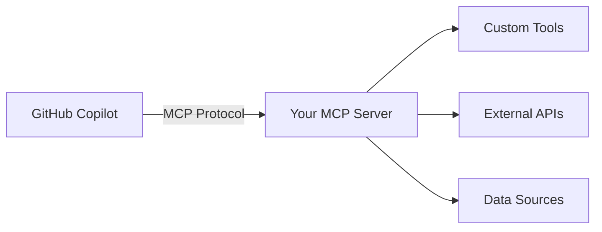

# Part 1: Understanding MCP and Setup

## Workshop Overview

This workshop takes you through building a complete GitHub Copilot Custom MCP Server using Azure Functions, progressing through four key stages:

1. **Local Development**: Build and test MCP server locally
2. **Azure Deployment**: Deploy serverless MCP server to Azure  
3. **GitHub Copilot Integration**: Connect MCP server to GitHub Copilot
4. **AI Integration**: Add Azure AI Foundry for intelligent analysis

## What is the Model Context Protocol (MCP)?

The Model Context Protocol (MCP) is an open standard that enables secure connections between AI applications (like GitHub Copilot) and external data sources and tools. It allows AI assistants to:

- Access external data securely
- Execute custom tools and scripts
- Maintain context across interactions
- Provide domain-specific capabilities

### MCP Architecture



## Workshop Tools Overview

We'll build three different types of tools to demonstrate MCP patterns:

### 🎓 Educational Tools
- **`markdown_review`**: Analyzes markdown content with local algorithms
- **`dependency_check`**: Checks npm packages for security and updates
- **Purpose**: Learn MCP concepts without external dependencies

### 🤖 Production Tools  
- **`ai_code_review`**: Uses Azure AI for intelligent code analysis
- **Purpose**: Demonstrate true MCP architecture (tools provide context, AI provides intelligence)

### 🔄 Hybrid Benefits
- All tools work offline for learning
- AI integration shows production capabilities
- Graceful fallbacks ensure reliability

## Prerequisites

### Required Software
- **Node.js 18+**: For Azure Functions runtime
- **Azure Functions Core Tools**: For local development
- **Azure CLI**: For deployment
- **Git**: For version control
- **VS Code**: Recommended editor

### Azure Account
- Free Azure account with:
  - Azure Functions (Consumption plan)
  - Azure AI Foundry (F0 free tier)
  - Resource group permissions

### GitHub Account
- GitHub account with Copilot access
- Repository for your MCP server

## Installation

### 1. Install Node.js and Tools

```bash
# Install Node.js 18+ from nodejs.org

# Install Azure Functions Core Tools
npm install -g azure-functions-core-tools@4 --unsafe-perm true

# Install Azure CLI
# Download from: https://docs.microsoft.com/cli/azure/install-azure-cli

# Verify installations
node --version
func --version
az --version
```

### 2. Clone and Setup Project

```bash
# Clone the workshop repository
git clone <your-repo-url>
cd serverless_mcp_on_functions_for_github_copilot

# Install dependencies
npm install

# Build the project
npm run build
```

### 3. Configure Local Environment

```bash
# Copy example settings
cp local.settings.json.example local.settings.json

# The file should contain:
{
  "IsEncrypted": false,
  "Values": {
    "AzureWebJobsStorage": "",
    "FUNCTIONS_WORKER_RUNTIME": "node",
    "ENABLE_AI_TOOL": "false"
  }
}
```

## Project Structure

```
├── src/
│   ├── functions/           # Azure Functions
│   │   └── mcp-server.ts   # Main MCP endpoint
│   ├── mcp/                # MCP protocol implementation
│   │   └── server.ts       # MCP server logic
│   ├── tools/              # Custom MCP tools
│   │   ├── markdown-review.ts
│   │   ├── dependency-check.ts
│   │   └── ai-code-review.ts
│   └── utils/              # Shared utilities
├── infra/                  # Azure Bicep templates
├── docs/                   # Workshop documentation
└── tests/                  # Test files
```

## Next Steps

Now that your environment is set up, let's move to [Part 2: Local Development](part-2-local-development.md) where we'll build and test the MCP server locally.

## Quick Verification

Test your setup:

```bash
# Verify project builds
npm run build

# Verify Azure Functions work
func start --port 7071
```

You should see output indicating the function app is running. Press Ctrl+C to stop.

✅ **Ready for Part 2!** Your development environment is configured and ready to build the MCP server.
