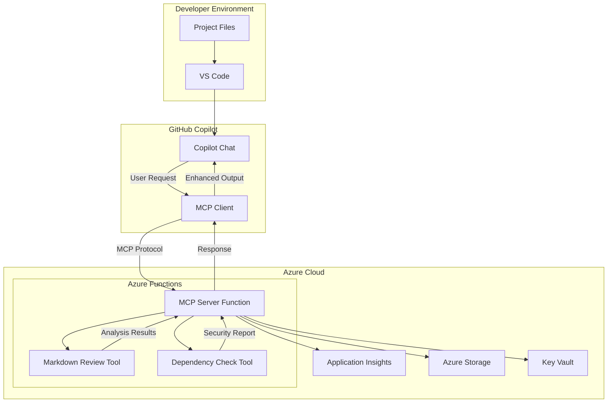

# Part 1: Understanding MCP and GitHub Copilot Integration

## What is the Model Context Protocol (MCP)?

The Model Context Protocol (MCP) is a groundbreaking open standard that creates secure, standardized connections between AI applications like GitHub Copilot and external data sources, tools, and services. Think of it as a universal adapter that allows AI assistants to safely access and interact with your development tools, APIs, and data.

### Key MCP Concepts

#### 1. **Secure Connections**
MCP establishes encrypted, authenticated connections between AI applications and external resources, ensuring that sensitive data and operations remain protected.

#### 2. **Standardized Interface**
Instead of each AI application implementing custom integrations, MCP provides a consistent protocol that works across different AI platforms and tools.

#### 3. **Tool Extensibility**
MCP allows you to extend AI capabilities by providing custom tools that the AI can discover and use automatically.

#### 4. **Context Preservation**
The protocol maintains context across interactions, allowing for more sophisticated and stateful operations.

## GitHub Copilot + MCP: A Powerful Combination

GitHub Copilot's integration with MCP transforms it from a code completion tool into a comprehensive development assistant that can:

- **Access External APIs**: Query databases, call REST APIs, and interact with cloud services
- **Execute Development Tools**: Run linters, formatters, security scanners, and custom scripts
- **Analyze Project Data**: Review documentation, check dependencies, and assess code quality
- **Automate Workflows**: Trigger deployments, create issues, and manage project tasks

### Real-World Example

Instead of manually running:
```bash
npm audit
npm outdated
markdownlint README.md
```

You can simply ask Copilot: *"Can you check my project for security issues and review my documentation?"*

Copilot will automatically use your custom MCP tools to:
1. Scan for security vulnerabilities
2. Check for outdated dependencies
3. Review markdown files for issues
4. Provide actionable recommendations

## Why Azure Functions for MCP Servers?

Azure Functions provides the ideal hosting platform for MCP servers with several key advantages:

### 1. **Serverless Architecture**
- **Pay-per-use**: Only pay for actual function executions
- **Zero maintenance**: No servers to manage or patch
- **Automatic scaling**: Handles traffic spikes automatically

### 2. **Security and Compliance**
- **Built-in authentication**: Azure AD, OAuth, and API key support
- **Network isolation**: VNet integration and private endpoints
- **Compliance**: SOC, ISO, and other industry certifications

### 3. **Developer Experience**
- **Multiple languages**: Node.js, Python, C#, Java, and more
- **Local development**: Azure Functions Core Tools for local testing
- **CI/CD integration**: GitHub Actions and Azure DevOps support

### 4. **Azure Ecosystem Integration**
- **Monitor**: Application Insights for observability
- **Secure secrets**: Key Vault integration
- **Data access**: Seamless integration with Azure services

## Architecture Deep Dive

Our workshop implementation follows this architecture:



### Communication Flow

1. **User Interaction**: Developer asks Copilot to perform a task
2. **MCP Discovery**: Copilot discovers available tools via MCP protocol
3. **Tool Selection**: Copilot selects appropriate tools for the task
4. **Secure Execution**: Tools execute in Azure Functions with proper authentication
5. **Result Processing**: Results are processed and formatted for the user
6. **Response Delivery**: Copilot presents actionable insights to the developer

## Benefits of This Approach

### For Developers
- **Enhanced Productivity**: AI assistant with custom capabilities
- **Consistent Experience**: Same tools available across different projects
- **Reduced Context Switching**: Stay in VS Code while accessing powerful tools

### For Teams
- **Standardized Tooling**: Shared MCP servers across team members
- **Centralized Maintenance**: Update tools in one place
- **Audit Trail**: All tool usage is logged and traceable

### for Organizations
- **Scalable Architecture**: Serverless scaling based on usage
- **Cost Effective**: Pay only for what you use
- **Secure by Design**: Enterprise-grade security controls
- **Compliance Ready**: Built on Azure's compliance foundation

---

## Getting Ready for Implementation

Now that you understand the foundation, let's move to [Part 2: Setting Up the Development Environment](./part-2-setup.md) where we'll prepare your local environment and start building our custom MCP server.

## Key Takeaways

✅ **MCP enables secure, standardized AI tool integration**
✅ **Azure Functions provides the perfect serverless hosting platform**
✅ **The combination creates powerful, scalable development assistants**
✅ **This approach scales from individual developers to enterprise teams**

Ready to build the future of AI-assisted development? Let's continue to the next section!
