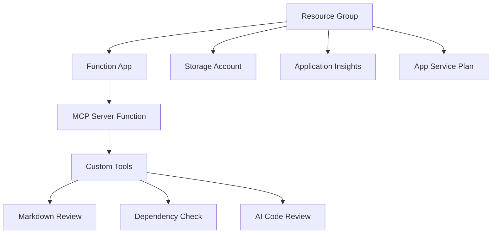

# Part 3: Azure Deployment & Architecture Deep Dive

> **Workshop Navigation**: [← Part 2: Local Development](part-2-local-development-and-building.md) | [Part 4: Copilot Integration →](part-4-copilot-integration.md)

## 🎯 Objective

Deploy your MCP server to Azure Functions for serverless hosting and understand the complete architecture, making it accessible to GitHub Copilot from anywhere.

---

## 🌟 Why Azure Functions for MCP Servers?

Azure Functions provides the ideal hosting platform for MCP servers:

- **Serverless**: Pay only for actual usage, perfect for MCP servers with sporadic traffic
- **Auto-scaling**: Handles sudden spikes when multiple developers use Copilot simultaneously  
- **Global reach**: Deploy to regions close to your development team
- **Integration**: Native integration with Azure AI services for advanced capabilities
- **Security**: Built-in authentication, HTTPS, and network isolation options

---

## 🏗️ Infrastructure Overview

Our Bicep templates create a complete serverless infrastructure:



### Core Components

1. **Resource Group**: Logical container for all resources
2. **Function App**: Serverless compute platform (Flex Consumption - FC1)
3. **Storage Account**: Required for Azure Functions runtime
4. **Application Insights**: Monitoring and observability
5. **App Service Plan**: Flex Consumption plan for optimal cost/performance

---

## 🚀 Azure Setup & Deployment

### 1. Prepare Azure Environment

```bash
# Login to Azure
az login

# Create resource group
az group create \
  --name mcp-workshop-rg \
  --location eastus

# Verify resource group creation
az group show --name mcp-workshop-rg
```

### 2. Configure Deployment Parameters

Create or update `infra/main.parameters.json`:

```json
{
  "$schema": "https://schema.management.azure.com/schemas/2019-04-01/deploymentParameters.json#",
  "contentVersion": "1.0.0.0",
  "parameters": {
    "functionAppName": {
      "value": "mcp-server-functions-<your-unique-name>"
    },
    "storageAccountName": {
      "value": "mcpstore<random-string>"
    },
    "location": {
      "value": "eastus"
    },
    "appInsightsName": {
      "value": "mcp-server-insights"
    }
  }
}
```

### 3. Deploy Infrastructure

```bash
# Deploy using Bicep
az deployment group create \
  --resource-group mcp-workshop-rg \
  --template-file infra/main.bicep \
  --parameters @infra/main.parameters.json

# Verify deployment
az functionapp list --resource-group mcp-workshop-rg --output table
```

### 4. Deploy Function Code

```bash
# Build the project
npm run build

# Deploy to Azure Functions
func azure functionapp publish mcp-server-functions-<your-unique-name>

# Verify deployment
curl https://mcp-server-functions-<your-unique-name>.azurewebsites.net/api/mcp-server
```

---

## 🔧 Understanding the MCP Server Architecture

### Core Components Overview

Our MCP server consists of several key components working together:

```
┌─────────────────────────────────────────────────────────────┐
│                    Azure Function App                      │
├─────────────────────────────────────────────────────────────┤
│  ┌───────────────┐  ┌─────────────────────────────────┐   │
│  │   HTTP        │  │        MCP Server Core          │   │
│  │   Handler     │──┤                                 │   │
│  │ (mcp-server.ts)│  │  • Request routing             │   │
│  └───────────────┘  │  • Tool management             │   │
│                     │  • Error handling              │   │
│                     │  • Logging                     │   │
│                     └─────────────────────────────────┘   │
│                                     │                      │
│                     ┌───────────────▼───────────────┐      │
│                     │           Tools               │      │
│                     │                               │      │
│                     │  ┌─────────────────────────┐  │      │
│                     │  │   Markdown Review       │  │      │
│                     │  │   • Structure analysis │  │      │
│                     │  │   • Link validation    │  │      │
│                     │  │   • Quality scoring    │  │      │
│                     │  └─────────────────────────┘  │      │
│                     │                               │      │
│                     │  ┌─────────────────────────┐  │      │
│                     │  │   Dependency Check      │  │      │
│                     │  │   • Security scanning  │  │      │
│                     │  │   • Update detection   │  │      │
│                     │  │   • Recommendation     │  │      │
│                     │  └─────────────────────────┘  │      │
│                     │                               │      │
│                     │  ┌─────────────────────────┐  │      │
│                     │  │   AI Code Review        │  │      │
│                     │  │   • Azure AI integration│  │      │
│                     │  │   • Intelligent analysis│ │      │
│                     │  │   • Contextual feedback │  │      │
│                     │  └─────────────────────────┘  │      │
│                     └───────────────────────────────┘      │
└─────────────────────────────────────────────────────────────┘
```

### MCP Protocol Implementation

Our server implements the core MCP protocol with these key methods:

```typescript
export class MCPServer {
  private tools: Map<string, MCPTool> = new Map();
  private config: MCPServerConfig;

  async handleRequest(request: HttpRequest): Promise<HttpResponseInit> {
    try {
      const body = await request.json();
      
      // Route based on MCP method
      switch (body.method) {
        case 'initialize':
          return this.initialize(body.params);
        case 'tools/list':
          return this.listTools();
        case 'tools/call':
          return this.callTool(body.params);
        case 'ping':
          return this.ping();
        default:
          return this.methodNotFound(body.method);
      }
    } catch (error) {
      return this.internalError(error);
    }
  }
}
```

**Supported Methods:**
- **initialize**: Handshake and capability negotiation
- **tools/list**: Discovery of available tools
- **tools/call**: Execution of specific tools
- **ping**: Health check and connectivity test

### Tool Registration Pattern

Tools are registered using a simple but powerful pattern:

```typescript
private registerTools() {
  // Educational tools - always available
  this.registerTool(new MarkdownReviewTool());
  this.registerTool(new DependencyCheckTool());
  
  // Production tool - configurable
  if (process.env.ENABLE_AI_TOOL !== 'false') {
    this.registerTool(new AiCodeReviewTool());
  }
}

registerTool(tool: MCPTool): void {
  this.tools.set(tool.name, tool);
  this.config.logger.info('Tool registered', {
    toolName: tool.name,
    description: tool.description
  });
}
```

This design allows for:
- **Dynamic registration**: Tools can be added at runtime
- **Type safety**: TypeScript interfaces ensure tool compliance
- **Observability**: All registrations are logged

---

## 🔍 Deep Dive: Tool Implementations

### Markdown Review Tool Architecture

```typescript
export class MarkdownReviewTool implements MCPTool {
  name = 'markdown_review';
  description = 'Analyze and provide improvement suggestions for markdown content';
  
  parameters = {
    content: {
      type: 'string',
      description: 'The markdown content to review'
    },
    analysis_type: {
      type: 'string', 
      enum: ['basic', 'comprehensive', 'accessibility'],
      default: 'comprehensive'
    }
  };

  async call(args: any): Promise<ToolResult> {
    const analyzer = new MarkdownAnalyzer();
    const results = await analyzer.analyze(args.content, args.analysis_type);
    
    return {
      content: [{
        type: "text",
        text: JSON.stringify(results, null, 2)
      }]
    };
  }
}
```

**Analysis Capabilities:**
- **Structure Analysis**: Headers, lists, code blocks organization
- **Link Validation**: Internal and external link checking
- **Accessibility**: Alt text, heading hierarchy, readability
- **Quality Scoring**: Comprehensive content assessment

### Dependency Check Tool Architecture

```typescript
export class DependencyCheckTool implements MCPTool {
  name = 'dependency_check';
  description = 'Analyzes npm dependencies for security and update recommendations';

  async call(args: any): Promise<ToolResult> {
    const checker = new DependencyChecker();
    const analysis = await checker.analyze(args.package_json);
    
    return {
      content: [{
        type: "text",
        text: JSON.stringify({
          summary: analysis.summary,
          security_issues: analysis.securityIssues,
          outdated_packages: analysis.outdatedPackages,
          recommendations: analysis.recommendations
        }, null, 2)
      }]
    };
  }
}
```

**Security Analysis:**
- **Vulnerability Detection**: Known CVE database checking
- **License Compliance**: License compatibility analysis
- **Update Recommendations**: Safe upgrade paths
- **Risk Assessment**: Impact scoring for issues

### AI Code Review Tool (Preview)

```typescript
export class AiCodeReviewTool implements MCPTool {
  name = 'ai_code_review';
  description = 'AI-powered code analysis using Azure OpenAI';

  async call(args: any): Promise<ToolResult> {
    // In Part 5, we'll connect this to Azure AI
    if (!this.isAzureAIConfigured()) {
      return this.getMockAnalysis(args);
    }
    
    const aiAnalyzer = new AzureAIAnalyzer();
    return await aiAnalyzer.analyzeCode(args);
  }
}
```

---

## 🧪 Testing Azure Deployment

### 1. Health Check

```bash
# Test basic connectivity
curl https://mcp-server-functions-<your-name>.azurewebsites.net/api/mcp-server \
  -X POST \
  -H "Content-Type: application/json" \
  -d '{"jsonrpc":"2.0","id":1,"method":"ping"}'
```

Expected response:
```json
{
  "jsonrpc": "2.0",
  "id": 1,
  "result": {
    "status": "ok",
    "timestamp": "2024-10-13T...",
    "server": "Azure Functions MCP Server"
  }
}
```

### 2. Tool Discovery

```bash
# List available tools
curl https://mcp-server-functions-<your-name>.azurewebsites.net/api/mcp-server \
  -X POST \
  -H "Content-Type: application/json" \
  -d '{"jsonrpc":"2.0","id":1,"method":"tools/list"}'
```

### 3. Tool Execution Testing

```bash
# Test markdown review tool
curl https://mcp-server-functions-<your-name>.azurewebsites.net/api/mcp-server \
  -X POST \
  -H "Content-Type: application/json" \
  -d '{
    "jsonrpc": "2.0",
    "id": 1,
    "method": "tools/call",
    "params": {
      "name": "markdown_review",
      "arguments": {
        "content": "# Test Document\n\nThis is a test with a [broken link](missing.md).",
        "analysis_type": "comprehensive"
      }
    }
  }'
```

---

## 📊 Monitoring & Observability

### Application Insights Integration

Your deployment includes comprehensive monitoring:

```typescript
export class MCPServer {
  private telemetry: TelemetryClient;

  constructor() {
    this.telemetry = new TelemetryClient();
  }

  async callTool(params: any): Promise<HttpResponseInit> {
    const startTime = Date.now();
    
    try {
      // Execute tool
      const result = await tool.call(params.arguments);
      
      // Track success
      this.telemetry.trackEvent('ToolCalled', {
        toolName: params.name,
        success: true,
        duration: Date.now() - startTime
      });
      
      return result;
    } catch (error) {
      // Track failure
      this.telemetry.trackException(error);
      throw error;
    }
  }
}
```

### Monitor in Azure Portal

1. Navigate to your Function App in Azure Portal
2. Go to **Application Insights** → **Live Metrics**
3. Monitor real-time requests and performance
4. View logs in **Logs** section using KQL queries

---

## 🔐 Security Configuration

### Environment Variables

Configure these for production:

```bash
# Set application settings
az functionapp config appsettings set \
  --name mcp-server-functions-<your-name> \
  --resource-group mcp-workshop-rg \
  --settings \
    ENABLE_AI_TOOL=false \
    LOG_LEVEL=info \
    MAX_REQUEST_SIZE=1048576
```

### Authentication (Optional)

For production deployments:

```bash
# Enable Azure AD authentication
az functionapp auth update \
  --name mcp-server-functions-<your-name> \
  --resource-group mcp-workshop-rg \
  --enabled true \
  --action LoginWithAzureActiveDirectory
```

---

## ✅ Deployment Verification Checklist

- [ ] Infrastructure deployed successfully to Azure
- [ ] Function app responds to HTTP requests
- [ ] All three MCP tools are discoverable via `tools/list`
- [ ] Each tool executes and returns expected results
- [ ] Application Insights is collecting telemetry
- [ ] Environment variables are properly configured

---

## 🎉 Production-Ready MCP Server!

Your MCP server is now deployed to Azure and ready for global access. You've accomplished:

- ✅ **Serverless deployment** on Azure Functions with Flex Consumption
- ✅ **Complete MCP protocol implementation** with proper error handling
- ✅ **Three working tools** demonstrating different MCP patterns
- ✅ **Production monitoring** with Application Insights
- ✅ **Scalable architecture** ready for team usage

---

> **Next Step**: Continue to [Part 4: Copilot Integration →](part-4-copilot-integration.md) where we'll connect your Azure-hosted MCP server to GitHub Copilot in VS Code.

---

## 🐛 Troubleshooting Deployment Issues

### Common Problems

**Function deployment fails:**
```bash
# Check deployment logs
func azure functionapp logstream mcp-server-functions-<your-name>
```

**Tools not responding:**
```bash
# Verify environment variables
az functionapp config appsettings list \
  --name mcp-server-functions-<your-name> \
  --resource-group mcp-workshop-rg
```

**Performance issues:**
- Monitor in Application Insights
- Check Function execution duration
- Verify Flex Consumption scaling

---

## 📚 Additional Resources

- [Azure Functions Deployment Guide](https://docs.microsoft.com/azure/azure-functions/functions-deployment-technologies)
- [Application Insights for Functions](https://docs.microsoft.com/azure/azure-monitor/app/azure-functions-supported-features)
- [MCP Production Best Practices](reference-architecture-patterns.md)
- [Bicep Template Documentation](https://docs.microsoft.com/azure/azure-resource-manager/bicep/)