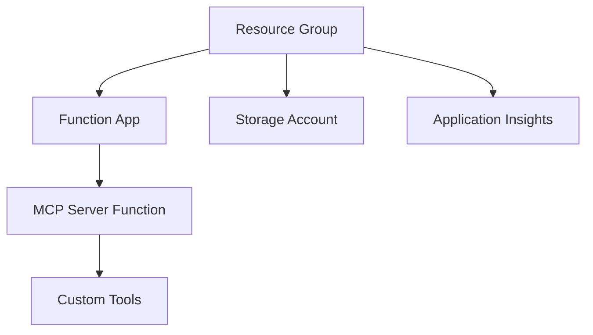

# Part 3: Azure Deployment

## Objective

Deploy your MCP server to Azure Functions for serverless hosting, making it accessible to GitHub Copilot from anywhere.

## Why Azure Functions for MCP Servers?

Azure Functions provides the ideal hosting platform for MCP servers:

- **Serverless**: Pay only for actual usage, perfect for MCP servers with sporadic traffic
- **Auto-scaling**: Handles sudden spikes when multiple developers use Copilot simultaneously  
- **Global reach**: Deploy to regions close to your development team
- **Integration**: Native integration with Azure AI services for advanced capabilities
- **Security**: Built-in authentication, HTTPS, and network isolation options

## Infrastructure Overview

Our Bicep templates create:



## Azure Setup

### 1. Login to Azure

```bash
# Login to your Azure account
az login

# Set your subscription (if you have multiple)
az account list --output table
az account set --subscription "Your Subscription Name"
```

### 2. Deploy Infrastructure

```bash
# Create resource group
az group create --name mcp-workshop-rg --location eastus

# Deploy infrastructure using Bicep
az deployment group create \
  --resource-group mcp-workshop-rg \
  --template-file infra/main.bicep \
  --parameters infra/main.parameters.json
```

The deployment creates:
- **Function App**: Hosts your MCP server
- **Storage Account**: Required for Azure Functions  
- **Application Insights**: Monitoring and logging
- **App Service Plan**: Consumption (serverless) plan

### 3. Deploy Application Code

```bash
# Build the project
npm run build

# Deploy to Azure Functions
func azure functionapp publish mcp-workshop-func --typescript
```

Expected output:
```
Deployment successful.
Functions in mcp-workshop-func:
    mcp-server - [httpTrigger]
        Invoke url: https://mcp-workshop-func.azurewebsites.net/api/mcp-server
```

## Testing Azure Deployment

### 1. Test the Deployed Function

```powershell
# Test Azure deployment
$azureUrl = "https://mcp-workshop-func.azurewebsites.net/api/mcp-server"
.\test-workshop.ps1 -TestLevel azure -FunctionUrl $azureUrl
```

### 2. Verify in Azure Portal

1. Go to [Azure Portal](https://portal.azure.com)
2. Navigate to your Function App (`mcp-workshop-func`)
3. Check **Functions** → `mcp-server` → **Monitor** for execution logs

### 3. Test Individual Components

```bash
# Test ping from command line
curl -X POST https://mcp-workshop-func.azurewebsites.net/api/mcp-server \
  -H "Content-Type: application/json" \
  -d '{"jsonrpc":"2.0","id":1,"method":"ping"}'

# Test tools list  
curl -X POST https://mcp-workshop-func.azurewebsites.net/api/mcp-server \
  -H "Content-Type: application/json" \
  -d '{"jsonrpc":"2.0","id":2,"method":"tools/list"}'
```

## Configuration Management

### Environment Variables

Your Azure Function needs these settings:

```json
{
  "AzureWebJobsStorage": "DefaultEndpointsProtocol=https;...",
  "FUNCTIONS_WORKER_RUNTIME": "node",
  "WEBSITE_NODE_DEFAULT_VERSION": "~18",
  "ENABLE_AI_TOOL": "true"
}
```

### Update Settings via CLI

```bash
# Add application settings
az functionapp config appsettings set \
  --name mcp-workshop-func \
  --resource-group mcp-workshop-rg \
  --settings "ENABLE_AI_TOOL=true"
```

### Update Settings via Portal

1. Go to Function App → **Configuration**
2. Add new application setting
3. **Save** and **Continue** (this restarts the function)

## Monitoring and Troubleshooting

### Application Insights Integration

View logs and metrics:

1. Function App → **Application Insights** 
2. **Live Metrics** for real-time monitoring
3. **Logs** for detailed execution traces

### Common Issues and Solutions

#### Function App Won't Start
```bash
# Check function app status
az functionapp show --name mcp-workshop-func --resource-group mcp-workshop-rg --query state

# View streaming logs
az webapp log tail --name mcp-workshop-func --resource-group mcp-workshop-rg
```

#### CORS Issues
If testing from browser:
```bash
# Enable CORS for development
az functionapp cors add \
  --name mcp-workshop-func \
  --resource-group mcp-workshop-rg \
  --allowed-origins "*"
```

#### Performance Issues
- Check **Application Insights** → **Performance** for slow requests
- Monitor **Function App** → **Monitor** for execution duration
- Consider upgrading from Consumption to Premium plan for consistent performance

## Security Considerations

### Production Checklist

1. **Authentication**: Enable Function App authentication
   ```bash
   az webapp auth update \
     --name mcp-workshop-func \
     --resource-group mcp-workshop-rg \
     --enabled true \
     --action LoginWithAzureActiveDirectory
   ```

2. **HTTPS Only**: Ensure HTTPS-only access
   ```bash
   az functionapp update \
     --name mcp-workshop-func \
     --resource-group mcp-workshop-rg \
     --set httpsOnly=true
   ```

3. **Network Security**: Configure virtual networks if needed
4. **Secrets Management**: Use Azure Key Vault for API keys
5. **Monitoring**: Set up alerts for unusual activity

### Development vs Production

**Development** (current setup):
- Anonymous access for easy testing
- CORS enabled for browser testing
- Detailed logging enabled

**Production** (recommended changes):
- Azure AD authentication
- Restricted CORS origins
- Network security groups
- Key Vault integration

## Cost Optimization

### Consumption Plan Benefits
- **No minimum cost**: Pay per execution
- **Automatic scaling**: From 0 to thousands of instances
- **Free tier**: 1M requests and 400K GB-seconds monthly

### Monitoring Costs
```bash
# Check current month's usage
az consumption usage list \
  --billing-period-name $(az billing period list --query "[0].name" -o tsv) \
  --resource-group mcp-workshop-rg
```

## Deployment Automation

### CI/CD Pipeline

Create `.github/workflows/deploy.yml`:

```yaml
name: Deploy MCP Server

on:
  push:
    branches: [main]

jobs:
  deploy:
    runs-on: ubuntu-latest
    steps:
    - uses: actions/checkout@v4
    
    - name: Setup Node.js
      uses: actions/setup-node@v4
      with:
        node-version: '18'
        
    - name: Install dependencies
      run: npm ci
      
    - name: Build project
      run: npm run build
      
    - name: Deploy to Azure Functions
      uses: Azure/functions-action@v1
      with:
        app-name: mcp-workshop-func
        package: .
        publish-profile: ${{ secrets.AZURE_FUNCTIONAPP_PUBLISH_PROFILE }}
```

## Verification

Your Azure deployment is successful when:

✅ Function app starts without errors  
✅ MCP ping responds with success  
✅ All three tools are discoverable  
✅ Tool calls return expected results  
✅ Application Insights shows telemetry  

Test command:
```powershell
.\test-workshop.ps1 -TestLevel azure -FunctionUrl "https://your-function-app.azurewebsites.net/api/mcp-server"
```

## Next Steps

Your MCP server is now running in Azure! Next, let's connect it to GitHub Copilot in [Part 4: GitHub Copilot Integration](part-4-copilot-integration.md).

## Workshop Progress

✅ **Part 1**: Setup and Understanding  
✅ **Part 2**: Local Development  
✅ **Part 3**: Azure Deployment ← **You are here**  
⏭️ **Part 4**: GitHub Copilot Integration  
⏭️ **Part 5**: AI Integration
