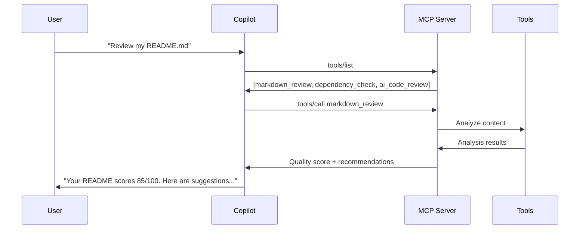

# Part 4: GitHub Copilot Integration

## Objective

Connect your Azure-hosted MCP server to GitHub Copilot, enabling Copilot to discover and use your custom tools for enhanced development assistance.

## Understanding GitHub Copilot MCP Integration

GitHub Copilot's MCP integration allows it to:

- **Discover tools** from your MCP server automatically
- **Call tools** based on conversation context
- **Maintain context** across multiple tool calls
- **Provide intelligent recommendations** using tool results

### How It Works



## GitHub Copilot Configuration

### Prerequisites

- GitHub account with Copilot subscription
- VS Code with GitHub Copilot extension
- Your MCP server deployed to Azure (from Part 3)

### 1. Get Your MCP Server URL

From your Azure deployment:
```bash
# Get the function URL
az functionapp function show \
  --name mcp-workshop-func \
  --resource-group mcp-workshop-rg \
  --function-name mcp-server \
  --query "invokeUrlTemplate" -o tsv
```

Example URL: `https://mcp-workshop-func.azurewebsites.net/api/mcp-server`

### 2. Configure MCP in VS Code

#### Method 1: VS Code Settings UI (Recommended)

1. **Open the Command Palette** (Ctrl+Shift+P)
2. **Search for "MCP"** and select `MCP: Open User Configuration`
3. **Add your server configuration** to the `mcp.json` file:

```json
{
  "servers": {
    "azure-mcp-server": {
      "type": "http",
      "url": "https://mcp-server-functions.azurewebsites.net/api/mcp-server"
    }
  }
}
```

#### Method 2: VS Code Settings (Alternative)

1. **Open VS Code Settings** (Ctrl+,)
2. **Search for "mcp"**
3. **Edit in settings.json**:

```json
{
  "chat.mcp.servers": {
    "azure-mcp-server": {
      "type": "http", 
      "url": "https://mcp-server-functions.azurewebsites.net/api/mcp-server"
    }
  }
}
```

#### Step 3: Restart VS Code

After configuring, restart VS Code to initialize the MCP server.

#### Step 4: Verify Connection

1. **Open the Command Palette** (Ctrl+Shift+P)
2. **Run `MCP: List Servers`** - you should see "azure-mcp-server" listed
3. **Check status** - it should show as "Running"
4. **Test in Copilot Chat**:

```
What MCP servers do you have available?
``` 

Expected output (Something similar):
```
MCP Servers:
✅ mcp-workshop (3 tools available)
   - markdown_review
   - dependency_check  
   - ai_code_review
```

## Testing GitHub Copilot Integration

### 1. Basic Tool Discovery

In Copilot Chat, ask:
```
What tools do you have available from my MCP server?
```

Copilot should list your three tools with descriptions.

### 2. Markdown Review Test

Create a sample README.md and ask:
```
Can you review my README.md file for quality and best practices?
```

Copilot should:
1. Detect the markdown_review tool
2. Call it with your README content
3. Present the quality score and recommendations

### 3. Dependency Analysis Test

In a project with package.json, ask:
```
Check my project dependencies for security issues and updates
```

Copilot should:
1. Use the dependency_check tool
2. Analyze your package.json
3. Report security vulnerabilities and update recommendations

### 4. Code Review Test

With some JavaScript code open, ask:
```
Review this code for quality and potential issues
```

Copilot should:
1. Use the ai_code_review tool
2. Analyze your code (mock analysis initially)
3. Provide feedback on code quality

## Advanced Usage Patterns

### Contextual Tool Usage

Copilot intelligently chooses tools based on context:

| Context | Likely Tool | Example Query |
|---------|-------------|---------------|
| README.md open | markdown_review | "Improve this documentation" |
| package.json visible | dependency_check | "Are my dependencies secure?" |
| JavaScript code selected | ai_code_review | "Find issues in this function" |

### Multi-Tool Workflows

Copilot can chain tool usage:

```
"Analyze my entire project for issues"
```

This might trigger:
1. **dependency_check** for package.json
2. **markdown_review** for README.md  
3. **ai_code_review** for source code files

### Custom Prompts

You can explicitly request tool usage:

```
"Use the markdown_review tool to analyze this content: [paste markdown]"
"Run dependency_check on my package.json"
"Get an AI code review for this function"
```

## Troubleshooting

### MCP Server Not Appearing

1. **Check VS Code Settings**:
   ```bash
   # View current settings
   code --list-extensions | grep copilot
   ```

2. **Verify MCP Server URL**:
   ```bash
   # Test the endpoint directly
   curl -X POST https://your-function-app.azurewebsites.net/api/mcp-server \
     -H "Content-Type: application/json" \
     -d '{"jsonrpc":"2.0","id":1,"method":"ping"}'
   ```

3. **Check VS Code Developer Console**:
   - `Help` → `Toggle Developer Tools`
   - Look for MCP-related errors in console

### Tools Not Working

1. **Test tools directly**:
   ```powershell
   .\test-workshop.ps1 -TestLevel copilot -FunctionUrl "https://your-url.azurewebsites.net/api/mcp-server"
   ```

2. **Check function logs**:
   ```bash
   az webapp log tail --name mcp-workshop-func --resource-group mcp-workshop-rg
   ```

3. **Verify CORS settings**:
   ```bash
   az functionapp cors show --name mcp-workshop-func --resource-group mcp-workshop-rg
   ```

### Performance Issues

1. **Cold starts**: First tool call may be slow (Azure Functions cold start)
2. **Network latency**: Consider deploying closer to your location
3. **Tool complexity**: AI tools will be slower than educational tools

## Security Considerations

### Development Setup
- Current configuration allows anonymous access
- Suitable for workshop and development purposes

### Production Recommendations

1. **Authentication**: Add API key or Azure AD authentication
   ```json
   {
     "github.copilot.chat.mcp.servers": {
       "mcp-workshop": {
         "endpoint": "https://your-app.azurewebsites.net/api/mcp-server",
         "headers": {
           "Authorization": "Bearer YOUR_API_KEY"
         }
       }
     }
   }
   ```

2. **Network Security**: Restrict access to known IP ranges
3. **Rate Limiting**: Implement throttling for API calls
4. **Audit Logging**: Track tool usage for security compliance

## Best Practices

### Tool Design
- **Idempotent**: Tools should be safe to call multiple times
- **Fast Response**: Keep tool execution under 30 seconds
- **Clear Errors**: Provide helpful error messages
- **Good Documentation**: Tools with clear descriptions work better

### MCP Server Configuration
- **Health Checks**: Implement monitoring for availability
- **Graceful Degradation**: Handle failures elegantly
- **Version Management**: Plan for tool schema evolution

## Verification Checklist

✅ **MCP Server Connected**: Shows in Copilot status  
✅ **Tools Discoverable**: Copilot lists your tools  
✅ **Markdown Review**: Works on documentation files  
✅ **Dependency Check**: Analyzes package.json correctly  
✅ **AI Code Review**: Returns analysis (mock mode initially)  
✅ **Error Handling**: Graceful failures when tools unavailable  

## Next Steps

GitHub Copilot is now using your custom MCP tools! Next, let's add real AI capabilities in [Part 5: AI Integration](part-5-ai-integration.md).

## Workshop Progress

✅ **Part 1**: Setup and Understanding  
✅ **Part 2**: Local Development  
✅ **Part 3**: Azure Deployment  
✅ **Part 4**: GitHub Copilot Integration ← **You are here**  
⏭️ **Part 5**: AI Integration
