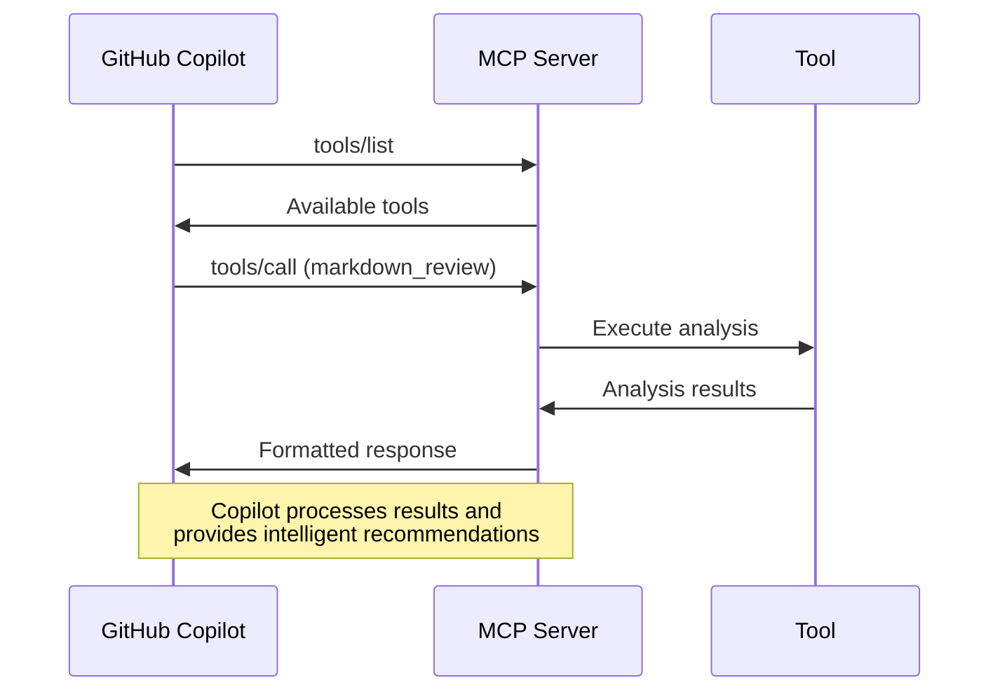

# Part 2: Local Development & Building MCP Server (Windows)

> **Workshop Navigation**: [← Part 1: Understanding MCP](part-1-setup-and-understanding.md) | [Part 3: Azure Deployment →](part-3-azure-deployment.md) | **Platform**: 🪟 Windows/PowerShell

## 🎯 Objective

Build and test the MCP server locally with three custom tools, understanding the difference between educational and production MCP patterns.

---

## ✅ Prerequisites Verification

Before we begin, let's verify that you have all the required tools installed using PowerShell:

### 1. Node.js Version Check

```powershell
node --version
# Should show v18.x.x or later
```

If you need to install or update Node.js:
- Visit [nodejs.org](https://nodejs.org/)
- Download the Windows Installer (.msi) for LTS version (18.x or later)
- Follow the installation wizard

### 2. Azure CLI Authentication

```powershell
# Check if Azure CLI is installed
az --version

# Login to Azure (this will open a browser)
az login

# Verify you're logged in
az account show
```

### 3. Azure Functions Core Tools

```powershell
# Check if Functions Core Tools are installed
func --version
# Should show 4.x.x or later

# If not installed, install globally
npm install -g azure-functions-core-tools@4 --unsafe-perm true
```

### 4. VS Code Extensions

Ensure you have these VS Code extensions installed:
- **Azure Functions** (ms-azuretools.vscode-azurefunctions)
- **GitHub Copilot** (GitHub.copilot)
- **Azure Account** (ms-vscode.azure-account)

---

## 🛠️ Project Setup (Windows)

### 1. Initialize the Project

You should already have the project files from cloning this repository. Let's set up the development environment:

```powershell
# Navigate to the project directory
Set-Location serverless_mcp_on_functions_for_github_copilot

# Install dependencies
npm install

# Copy environment configuration
Copy-Item local.settings.json.example local.settings.json
```

### 2. Configure Environment Variables

Open the `local.settings.json` file and update the following values:

```powershell
# Edit the file using your preferred editor
code local.settings.json
# Or use notepad
notepad local.settings.json
```

Update the content to:
```json
{
  "IsEncrypted": false,
  "Values": {
    "AzureWebJobsStorage": "",
    "FUNCTIONS_WORKER_RUNTIME": "node",
    "ENABLE_AI_TOOL": "false",
    "AZURE_SUBSCRIPTION_ID": "your-subscription-id-here",
    "AZURE_FUNCTION_APP_NAME": "mcp-server-functions-your-name",
    "AZURE_REGION": "eastus"
  }
}
```

**How to get your subscription ID:**
```powershell
az account show --query id --output tsv
```

### 3. Verify Project Structure

Your project should now have this structure:

```
serverless_mcp_on_functions_for_github_copilot\
├── local.settings.json           # Local environment configuration
├── local.settings.json.example   # Example environment file
├── src\
│   ├── functions\               # Azure Functions
│   │   └── mcp-server.ts       # Main MCP endpoint
│   ├── mcp\                    # MCP protocol implementation
│   │   ├── server.ts           # MCP server logic
│   │   └── types.ts            # MCP type definitions
│   ├── tools\                  # Custom MCP tools
│   │   ├── base-tool.ts        # Base tool interface
│   │   ├── markdown-review.ts  # Markdown analysis tool
│   │   ├── dependency-check.ts # Dependency analysis tool
│   │   └── ai-code-review.ts   # AI-powered code review
│   └── utils\                  # Shared utilities
│       └── logger.ts           # Logging utilities
├── infra\                      # Azure Bicep templates
├── docs\                       # Workshop documentation
└── tests\                      # Test files
```

---

## 🏗️ Understanding the MCP Implementation

Let's examine the core components of our MCP server:

### 1. MCP Server Core (`src\mcp\server.ts`)

```typescript
export class MCPServer {
  private tools: Map<string, MCPTool> = new Map();

  constructor() {
    this.registerTools();
  }

  private registerTools() {
    // Educational tools - always available
    this.tools.set('markdown_review', new MarkdownReviewTool());
    this.tools.set('dependency_check', new DependencyCheckTool());
    
    // Production tool - configurable
    if (process.env.ENABLE_AI_TOOL !== 'false') {
      this.tools.set('ai_code_review', new AiCodeReviewTool());
    }
  }

  async handleRequest(request: HttpRequest): Promise<HttpResponseInit> {
    try {
      const body = await request.json();
      
      switch (body.method) {
        case 'tools/list':
          return this.listTools();
        case 'tools/call':
          return this.callTool(body.params);
        default:
          return this.methodNotFound(body.method);
      }
    } catch (error) {
      return this.internalError(error);
    }
  }
}
```

### 2. Azure Functions Wrapper (`src\functions\mcp-server.ts`)

```typescript
import { app, HttpRequest, HttpResponseInit } from '@azure/functions';
import { MCPServer } from '../mcp/server';

app.http('mcp-server', {
  methods: ['GET', 'POST'],
  authLevel: 'anonymous',
  handler: async (request: HttpRequest): Promise<HttpResponseInit> => {
    // Handle MCP protocol requests
    const server = new MCPServer();
    return await server.handleRequest(request);
  }
});
```

---

## 🔧 Building the Tools

Our three tools demonstrate different MCP patterns:

### Educational Tool 1: Markdown Review

This tool analyzes markdown content locally using algorithms:

```typescript
export class MarkdownReviewTool implements MCPTool {
  name = 'markdown_review';
  description = 'Analyzes markdown content for structure, links, and quality';

  async call(args: any): Promise<ToolResult> {
    const { content, analysis_type = 'comprehensive' } = args;
    
    // Local analysis algorithms
    const issues = this.findIssues(content);
    const recommendations = this.generateRecommendations(content);
    const qualityScore = this.calculateQualityScore(content, issues);
    
    return {
      content: [{
        type: "text",
        text: JSON.stringify({
          quality_score: qualityScore,
          issues,
          recommendations,
          analysis_type,
          word_count: content.split(/\s+/).length
        })
      }]
    };
  }

  private findIssues(content: string): string[] {
    const issues = [];
    
    // Check for broken internal links
    const internalLinks = content.match(/\[.*?\]\([^http][^)]*\)/g) || [];
    if (internalLinks.length > 0) {
      issues.push(`Found ${internalLinks.length} internal link(s) that should be validated`);
    }
    
    // Check for missing alt text in images
    const imagesWithoutAlt = content.match(/!\[\s*\]/g) || [];
    if (imagesWithoutAlt.length > 0) {
      issues.push(`Found ${imagesWithoutAlt.length} image(s) missing alt text`);
    }
    
    // Check for very long lines (>100 chars)
    const lines = content.split('\n');
    const longLines = lines.filter(line => line.length > 100);
    if (longLines.length > 0) {
      issues.push(`Found ${longLines.length} lines longer than 100 characters`);
    }
    
    return issues;
  }
}
```

### Educational Tool 2: Dependency Check

This tool analyzes package.json for security and updates:

```typescript
export class DependencyCheckTool implements MCPTool {
  name = 'dependency_check';
  description = 'Analyzes npm dependencies for security and update recommendations';

  async call(args: any): Promise<ToolResult> {
    const { package_json, check_type = 'comprehensive' } = args;
    
    try {
      const packageData = JSON.parse(package_json);
      const analysis = this.analyzePackages(packageData);
      
      return {
        content: [{
          type: "text", 
          text: JSON.stringify(analysis)
        }]
      };
    } catch (error) {
      return {
        content: [{
          type: "text",
          text: JSON.stringify({
            error: "Invalid package.json format",
            message: error.message
          })
        }],
        isError: true
      };
    }
  }

  private analyzePackages(packageData: any) {
    const dependencies = packageData.dependencies || {};
    const devDependencies = packageData.devDependencies || {};
    const allDeps = { ...dependencies, ...devDependencies };
    
    const knownVulnerablePackages = [
      'lodash', 'moment', 'request', 'bower'
    ];
    
    const outdatedPatterns = ['^0.', '^1.', '^2.'];
    
    const vulnerablePackages = Object.keys(allDeps).filter(pkg => 
      knownVulnerablePackages.includes(pkg.toLowerCase())
    );
    
    const potentiallyOutdated = Object.entries(allDeps).filter(([pkg, version]) =>
      outdatedPatterns.some(pattern => String(version).startsWith(pattern))
    );
    
    return {
      total_dependencies: Object.keys(allDeps).length,
      potentially_vulnerable: vulnerablePackages,
      potentially_outdated: potentiallyOutdated.map(([pkg, version]) => ({
        package: pkg,
        current_version: version
      })),
      recommendations: this.generateRecommendations(vulnerablePackages, potentiallyOutdated)
    };
  }
}
```

### Production Tool: AI Code Review

This tool integrates with Azure AI for intelligent analysis:

```typescript
export class AiCodeReviewTool implements MCPTool {
  name = 'ai_code_review';
  description = 'AI-powered code analysis using Azure OpenAI';

  async call(args: any): Promise<ToolResult> {
    const { code, language = 'typescript', review_type = 'comprehensive' } = args;
    
    // Check if AI integration is enabled
    if (process.env.ENABLE_AI_TOOL === 'false') {
      return this.getMockResponse(code, language, review_type);
    }
    
    try {
      // In a real implementation, this would call Azure OpenAI
      const analysis = await this.performAIAnalysis(code, language, review_type);
      return {
        content: [{
          type: "text",
          text: JSON.stringify(analysis)
        }]
      };
    } catch (error) {
      // Graceful fallback to mock analysis
      return this.getMockResponse(code, language, review_type);
    }
  }
  
  private getMockResponse(code: string, language: string, reviewType: string) {
    return {
      content: [{
        type: "text",
        text: JSON.stringify({
          analysis_type: "mock_ai_analysis",
          language,
          review_type: reviewType,
          code_quality_score: 85,
          issues: [
            "Consider adding more descriptive variable names",
            "Function complexity could be reduced by breaking into smaller functions"
          ],
          suggestions: [
            "Add TypeScript type annotations for better type safety",
            "Consider using async/await for better readability"
          ],
          security_concerns: [],
          performance_notes: [
            "Code appears to have good performance characteristics"
          ]
        })
      }]
    };
  }
}
```

---

## 🚀 Building and Testing (Windows)

### 1. Build the Project

```powershell
# Compile TypeScript to JavaScript
npm run build

# Verify build output exists
Test-Path dist\index.js
# Should return True
```

### 2. Start the Local Development Server

```powershell
# Start Azure Functions locally
func start --port 7071

# Keep this terminal open - you should see:
# Azure Functions Core Tools
# Core Tools Version: 4.x.x
# Functions:
#   mcp-server: [POST,GET] http://localhost:7071/api/mcp-server
```

### 3. Test MCP Protocol Endpoints (Windows PowerShell)

#### Test Tool Discovery

```powershell
# Use Invoke-RestMethod for HTTP testing
$body = @{
    jsonrpc = "2.0"
    id = 1
    method = "tools/list"
} | ConvertTo-Json

Invoke-RestMethod -Uri "http://localhost:7071/api/mcp-server" `
                  -Method POST `
                  -Body $body `
                  -ContentType "application/json"
```

Expected response:
```json
{
  "jsonrpc": "2.0",
  "id": 1,
  "result": {
    "tools": [
      {
        "name": "markdown_review",
        "description": "Analyzes markdown content for structure, links, and quality"
      },
      {
        "name": "dependency_check", 
        "description": "Analyzes npm dependencies for security and update recommendations"
      },
      {
        "name": "ai_code_review",
        "description": "AI-powered code analysis using Azure OpenAI"
      }
    ]
  }
}
```

#### Test Markdown Review Tool

```powershell
$body = @{
    jsonrpc = "2.0"
    id = 2
    method = "tools/call"
    params = @{
        name = "markdown_review"
        arguments = @{
            content = "# Test`n`nThis is a [broken link](nonexistent.md) and an image ."
        }
    }
} | ConvertTo-Json -Depth 10

Invoke-RestMethod -Uri "http://localhost:7071/api/mcp-server" `
                  -Method POST `
                  -Body $body `
                  -ContentType "application/json"
```

#### Test Dependency Check Tool

```powershell
$packageJson = '{"dependencies":{"lodash":"^3.10.1","express":"^4.18.2"}}'

$body = @{
    jsonrpc = "2.0"
    id = 3
    method = "tools/call"
    params = @{
        name = "dependency_check"
        arguments = @{
            package_json = $packageJson
        }
    }
} | ConvertTo-Json -Depth 10

Invoke-RestMethod -Uri "http://localhost:7071/api/mcp-server" `
                  -Method POST `
                  -Body $body `
                  -ContentType "application/json"
```

---

## 🎯 Workshop Testing Scripts (Windows)

Use the provided PowerShell test scripts for easier testing:

```powershell
# Test all tools at once
.\test-workshop.ps1 -TestLevel local

# Test specific functionality  
.\test-all-tools.ps1

# Test with verbose output
.\test-workshop.ps1 -TestLevel local -Verbose
```

---

## 🔍 Understanding Tool Patterns

### Educational vs Production Tools

| Aspect | Educational Tools | Production Tools |
|--------|------------------|------------------|
| **Data Source** | Local algorithms | External APIs/AI |
| **Dependencies** | None | Azure AI, databases |
| **Reliability** | 100% available | Depends on external services |
| **Intelligence** | Rule-based | AI-powered analysis |
| **Use Case** | Learning MCP | Real-world applications |

### MCP Protocol Flow



---

## ✅ Verification Checklist

- [ ] All dependencies installed successfully
- [ ] Project builds without errors (`npm run build`)
- [ ] Local Azure Functions server starts (`func start`)
- [ ] MCP endpoints respond to HTTP requests
- [ ] All three tools return expected results
- [ ] Test scripts pass (`.\test-workshop.ps1 -TestLevel local`)

---

## 🎉 Ready for Azure Deployment!

Your MCP server is now working locally with three custom tools. You've learned:

- ✅ **MCP protocol implementation** with JSON-RPC 2.0
- ✅ **Tool pattern differences** (educational vs production)
- ✅ **Local testing strategies** for MCP servers
- ✅ **Azure Functions integration** for serverless hosting

---

> **Next Step**: Continue to [Part 3: Azure Deployment →](part-3-azure-deployment.md) where we'll deploy your MCP server to Azure Functions for global access using PowerShell and Azure CLI.

---

## 🐛 Troubleshooting (Windows)

### Common Issues

**Functions won't start:**
```powershell
# Clear npm cache and reinstall
npm cache clean --force
npm install
npm run build
```

**Port already in use:**
```powershell
# Use different port
func start --port 7072

# Or find what's using the port
netstat -ano | findstr :7071
```

**TypeScript compilation errors:**
```powershell
# Check Node.js version
node --version
# Ensure you have Node.js 18+

# Clear TypeScript cache
Remove-Item -Recurse -Force dist
npm run build
```

**PowerShell execution policy issues:**
```powershell
# Check current policy
Get-ExecutionPolicy

# Set to allow local scripts (if needed)
Set-ExecutionPolicy -ExecutionPolicy RemoteSigned -Scope CurrentUser
```

---

## 📚 Additional Resources

- [Azure Functions Local Development](https://docs.microsoft.com/azure/azure-functions/functions-develop-local)
- [MCP Protocol Specification](https://modelcontextprotocol.io/specification/)
- [TypeScript Azure Functions Guide](https://docs.microsoft.com/azure/azure-functions/functions-reference-node)
- [PowerShell for Azure Development](https://docs.microsoft.com/en-us/powershell/azure/)
- [Windows Azure Functions Development](https://docs.microsoft.com/en-us/azure/azure-functions/functions-develop-vs-code?tabs=csharp)